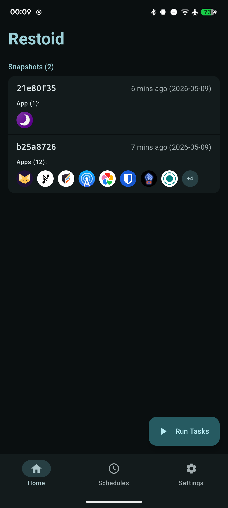
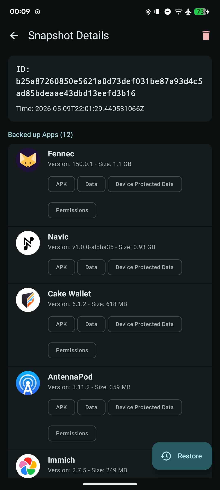
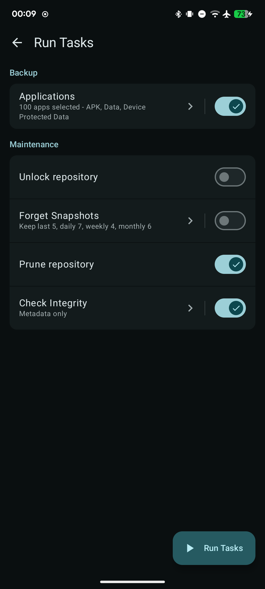

# Restoid
A modern, root-based Android backup tool powered by [`restic`](https://github.com/restic/restic/).

Restoid gives you control over your app backups through a clean and simple user interface. It's built for users who want robust, encrypted, and deduplicated backups.

## 📥 Download

  &nbsp;
  &nbsp;
  

  Official F-Droid updates may be delayed. For instant updates directly from CI, <a href="https://fdroid.link/#https://hddq.github.io/restoid/fdroid/repo?fingerprint=E6629E27D6CDC87B15F68C43F7D7DF8904AC8EFC76D87C7903976C3A38233AC5">add the custom repository</a>

## 📸 Screenshots

  
  
  

## ✨ Features

* **Restic-Powered**: Leverages the speed, security, and efficiency of `restic` for deduplicated and encrypted backups.
* **Selective App Backup**: Choose exactly which user-installed applications you want to back up.
* **Full Control Over What You Back Up**: Granularly select what to include for each app: APK files, user data, device-protected data, external/OBB/media files.
* **Flexible Repository Management**: Create and manage repositories across native restic backends: Local directory, SFTP, REST server, and Amazon S3/MinIO.
* **Snapshot Management**: Easily browse backup snapshots, view details of what was backed up, and forget old snapshots.
* **Flexible Restore**: Restore entire apps or just specific parts (like only app data).
* **Downgrade Protection**: Prevents you from accidentally restoring an older app version over a newer one (can be overridden).
* **Zero-Hassle Dependencies**: Automatically downloads and manages the `restic` binary for your device's architecture.

## ⚠️ Requirements

* **Root Access**: Restoid requires elevated privileges to access app data directories. It uses `libsu` for robust root command execution.
* **Android Version**: Minimum SDK 33 (Android 13).

## 🚀 Getting Started

1.  **Grant Root**: Launch the app and grant it Superuser access when prompted.
2.  **Install Restic**: Go to **Settings**. The app will show that `restic` is not installed. Tap **Download** to automatically fetch and set it up.
3.  **Create a Repository**:
   * In **Settings**, tap the `+` icon to add a new repository.
   * Choose a backend type (local or one of the supported remote backends).
   * For local repositories, select a folder on your device. For remote repositories, enter the restic repository specification.
   * If needed, add backend credentials as environment variables (one `KEY=value` per line).
   * Set a strong password to encrypt your backups. You can choose to save it securely in the app.
4.  **Run Your First Backup**:
   * Go **Home** and tap the **Backup** FAB (the `+` button).
   * Choose what data types you want to back up (APK, Data, etc.).
   * Select the apps.
   * Tap **Start Backup** and watch the magic happen.
5.  **Restore From a Backup**:
   * From the **Home** screen, tap on a snapshot.
   * Tap **Restore**, select what you want to bring back, and confirm.

## 🤝 How to Contribute

If you find a bug, have a feature request, or want to help clean up the code, please:

1.  **Open an issue** to discuss the change.
2.  Fork the repository and submit a pull request.

All contributions are welcome!

## 🌐 Translations

Translations for Restoid are managed via Weblate. If you'd like to help translate the app, [please visit the project page](https://hosted.weblate.org/projects/restoid/)

### 🌍 How to contribute translations:

- Create an account on Weblate (if you don't already have one).
- Pick a language and translate strings using Weblate's web interface.
- Submitted translations will be reviewed by the maintainers and integrated into the project.

If you prefer to contribute translations through GitHub (by editing Android string resources directly), open a pull request.

## 📜 License

This project is licensed under the **GNU General Public License v3.0**. See the `LICENSE` file for details.
